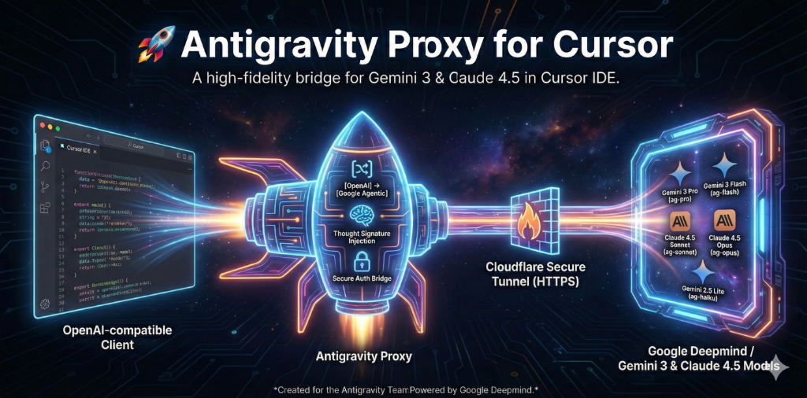

# Antigravity Proxy for Cursor

A high-fidelity bridge that brings Google's latest **Gemini 3** and **Claude 4.5** models directly into your Cursor IDE with full Agentic and Composer support.

## Why Antigravity Proxy?
Google's advanced agentic models (internal versions of Gemini/Claude) use a specific protocol that standard OpenAI-compatible clients (like Cursor) cannot understand natively. This proxy:
1.  **Translates Protocols**: Converts OpenAI requests into Google's Agentic format.
2.  **Injects Thought Signatures**: Automatically handles the complex reasoning traces required for tool calling.
3.  **Bridges Authentication**: Securely extracts your local Cloud Code session tokens so you don't need manual API keys.

---

## 🛠️ How it Works: The Cloudflare Tunnel
When you run `npm start`, the engine launches two processes:
1.  **Local Proxy Server**: Runs on `localhost:3000`.
2.  **Cloudflare Quick Tunnel**: Creates a secure, temporary HTTPS bridge from the internet's edge directly to your local proxy.

### Why is the Tunnel necessary?
*   **HTTPS Requirement**: High-security IDEs like Cursor often require a valid, trusted HTTPS endpoint to talk to custom models.
*   **Zero-Config Networking**: It allows the proxy to work through firewalls and VPNs without you having to open any ports or touch router settings.
*   **Security**: The tunnel provides a random, difficult-to-guess URL that is only active while your process is running.

> [!CAUTION]
> **Dynamic URLs**: Because we are using Cloudflare's *Quick Tunnel* mode (free version), a **fresh URL is generated every time you restart the script**. You will need to update the URL in Cursor whenever the terminal shows a new one.

---

## Setup Instructions

### 1. Start the Proxy
In your terminal, run:
```bash
npm start
```
Watch for the big green rocket icon. Copy the **Base URL** (e.g., `https://random-words.trycloudflare.com/v1`).

### 2. Configure Cursor
1.  Open **Cursor Settings** (`Cmd + Shift + J` or Click the gear icon).
2.  Go to **Models** > **OpenAI**.
3.  **CRITICAL**: Enable the **"Override OpenAI Base URL"** toggle.
4.  Paste your **New Base URL** into the field.
5.  (Optional but Recommended) **Restart Cursor** to ensure the new networking configuration is fully picked up by the internal AI engine.

### 3. Model Selection
In the Cursor sidebar or Composer, select one of these IDs:
*   `ag-pro`: Gemini 3 Pro (High intelligence, architecture).
*   `ag-flash`: Gemini 3 Flash (Sub-second latency, quick edits).
*   `ag-sonnet`: Claude 4.5 Sonnet (Thinking model, deep reasoning).
*   `ag-opus`: Claude 4.5 Opus (Maximum logic, complex debugging).
*   `ag-haiku`: Gemini 2.5 Lite (Fast and efficient).

---

## ⚠️ Troubleshooting
*   **400 Error (Missing Thought Signature)**: This is fixed! Ensure you are running the latest version of this proxy.
*   **Invalid URL Error**: This means your tunnel URL has changed or expired. Restart the proxy and copy the new URL from the terminal.
*   **EADDRINUSE**: If you see "Address already in use", run `lsof -t -i:3000 | xargs kill -9` to clear the previous process.

---
*Created for the Antigravity Team. Powered by Google Deepmind.*
